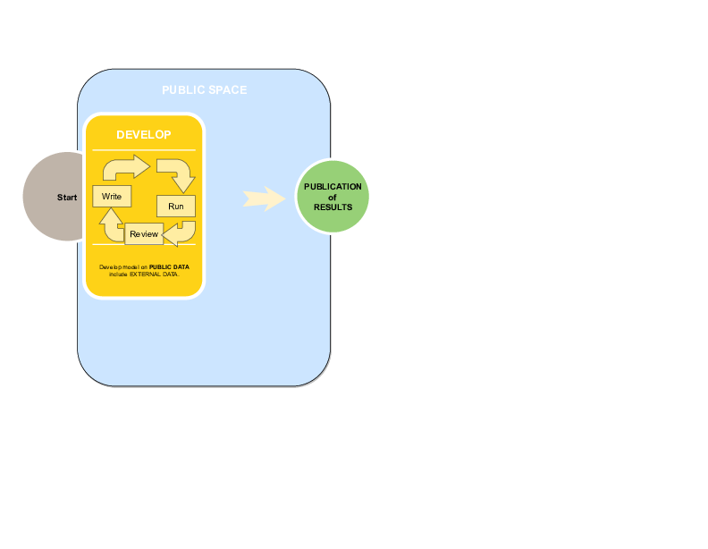

# User perspective

## Use provided container with pre-provisioned data

Possibilities:

- use directly (*safer*)
- use as input to build own container (addition of components)

## Critically

Pre-provisioned data does not need to be "**analytically valid**" - need only be "**plausible**"!

## Develop where feasible

Containers are generalized technology

- can be run on provisioned university computing infrastucture (most HPC systems can run containers)
- can run on desktops as needed (free container software available for all major operating systems for non-commercial use)
- can run on generic cloud infrastructure (AWS, Google Cloud, Azure)
- can run on custom cloud infrastructure specialized in running containers ([Nuvolos](https://nuvolos.cloud), [Codeocean](https://codeocean.com), [Onyxia](https://www.onyxia.sh/), etc.)
- can be prepared by research institutions for use on their custom infrastructure (e.g., NSF-funded [Whole Tale project](https://wholetale.org), self-hosted [Onyxia](https://www.onyxia.sh/))

## Whole Tale

[](https://wholetale.org)

## Codeocean

[](https://codeocean.com)

## Onyxia

[](https://www.onyxia.sh/)

## Cost to user

Cost: \$0 to low \$

## Run a container from the command line

```{r include_run, eval=FALSE, results='asis'}
## read the file run_docker.sh
tail(readLines("run_docker.sh"),n=1)
```

## Run a container from Codeocean


---


## Develop at will

- Arbitrary Stata, R, Python, etc. code




