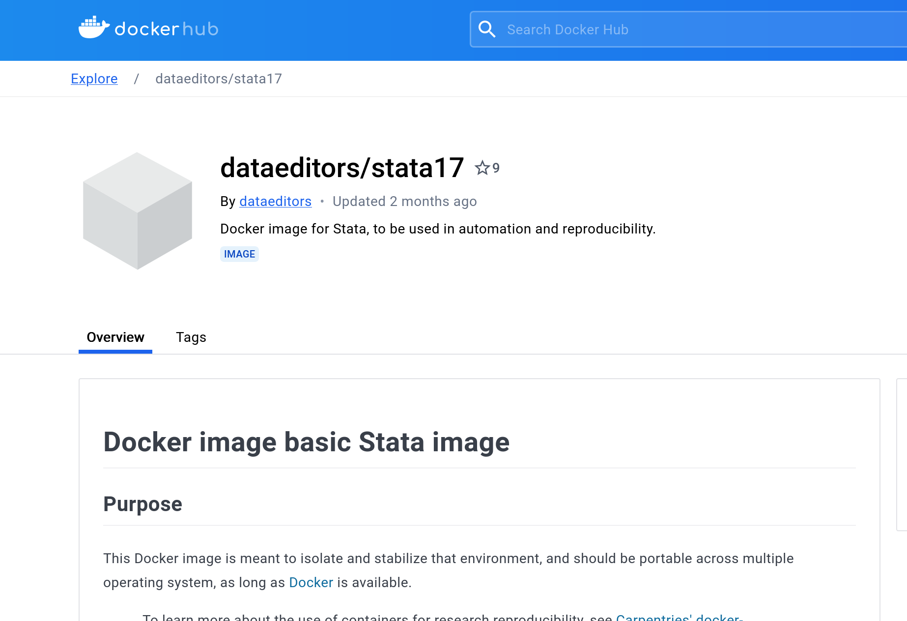

# Provider perspective: Secure build

## First impressions


[^img1]

[^img1]: Image credit [Christopher Scholz](https://www.flickr.com/photos/140988606@N08/27509199696), under [CC-By-SA 2.0](https://creativecommons.org/licenses/by-sa/2.0/)

## Internal build

- Prepare an internal container, compliant with IT security standards
  - secure configuration of container running system (base system)
  - add layer of common software (Stata, R, Python, various combinations) for **analysis system**
  - test suite (scripted) for updates
- Can leverage existing container recipes for well-known software packages (`rocker` for R containers, datascience containers)
- Can leverage existing containers and harden the OS (if necessary)


## Public build

- Public "recipe" is the same as for internal
  - possibly up to secure base container - close enough is good enough
  - built by StatAgency itself


## Example: Build internal analysis system

```Dockerfile
FROM registry.internal.statagency.gov/os/ubuntu-24.04-secured

# Install Stata from internal sources (simple tar file), no license
...
# Install R from internal sources
...
USER rstudio
```

## Example: Build public analysis system

```Dockerfile
FROM ubuntu-24.04

# Install Stata from internal sources (simple tar file), no license
...
# Install R from internal sources
...
USER rstudio
```


## Optional elements

While not strictly necessary, containers might contain

- development environments (Stata GUI, Jupyter notebooks, Rstudio)
- standard set of libraries (Stata ado files, R libraries, Python packages)

## Public posting

Prepared containers and recipes can be posted on public registries:

  - post container on public registry ([Docker Hub](https://hub.docker.com), [Google Container Registry](https://cloud.google.com/container-registry), etc.)
  - post recipe on public repository ([GitHub](https://github.com), [GitLab](https://gitlab.com), etc.)

## Posted on Docker Hub



