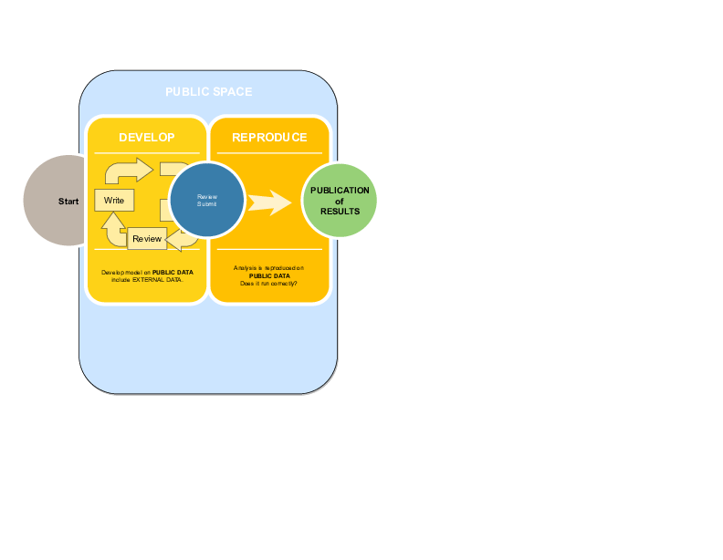
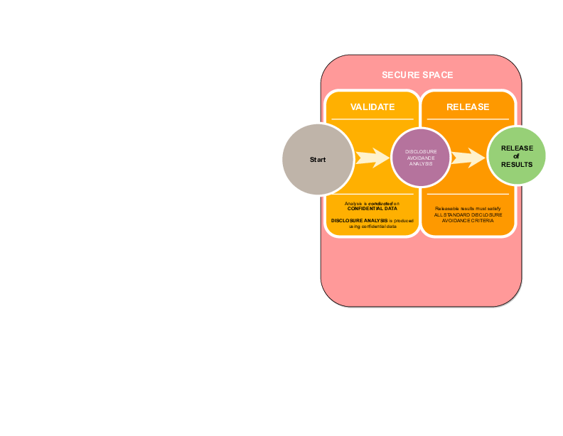

# Validation

## User Develops


## User tests




## User Submits for Validation

- Submit container *recipe* (`Dockerfile`) and code for validation to *StatAgency.gov*

```
./Dockerfile
./code/01_prepare_data.R
./code/02_run_analysis.R
./code/03_create_figures.R
```

## Important security aspect

**No binary code is transmitted**

Any external data may need to be vetted.

## *StatAgency* Upon receipt of submission

(**Automated**) system receives and processes 

```
./Dockerfile
./code/01_prepare_data.R
./code/02_run_analysis.R
./code/03_create_figures.R
```
## *StatAgency* validates reproducibility

Just to check that user actually did test...


## Provider validates reproducibility 

If rejected, **automated system** returns to user without further ado.

If accepted, proceed to validation step

## Provider rebuilds container using secure base image

- Input is only the `Dockerfile` recipe
- Security scanning of (plaintext) scripts and of resulting image
- Build can occur in a sandboxed environment

## Necessary restrictions

While useful in the public space, when running internally and for pre-vetting,

- containers would be restricted in terms of internet access
- containers may be built against only known safe sources of packages (e.g. internal mirrors)


## Once image is built



## Validate against confidential data

- Same image is used for confidential data
- Only difference: swap out public (test) data for confidential data
- Processing may involve more complex processing, for instance **bootstrapping errors** or **obtaining multiple estimates** across various partially protected datasets
- Disclosure avoidance may involve transparently **modifying certain functions**, or **post-processing of results**

## Return results to user

