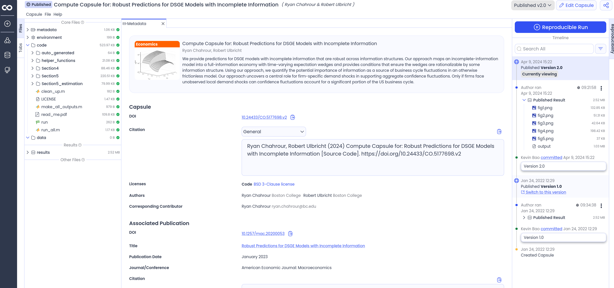

# Quick links for the curious

- [https://www.datacamp.com/tutorial/docker-for-data-science-introduction](https://www.datacamp.com/tutorial/docker-for-data-science-introduction)
- [CodeOcean](https://codeocean.com/)
- [Whole Tale](https://wholetale.org/)
- [Onyxia](https://www.onyxia.sh/)
- [Docker Hub](https://hub.docker.com/)
- [Stata on Docker](https://github.com/AEADataEditor/docker-stata)

---

